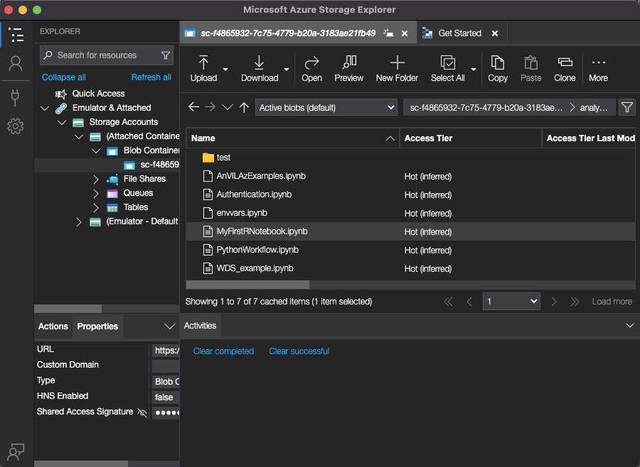

```{r setup, include = FALSE}
az_ok <- az_health_check()
knitr::opts_chunk$set(
    collapse = TRUE,
## Related to https://stat.ethz.ch/pipermail/bioc-devel/2020-April/016656.html
    crop = NULL,
    eval = az_ok
)
options(width = 75)
```

# Installation

The package is not yet available from [Bioconductor](https://bioconductor.org). 

Install the development version of the _AnVILAz_ package from GitHub
with

```{r install, eval = FALSE}
if (!requireNamespace("BiocManager", quietly = TRUE))
    install.packages("BiocManager", repos = "https://cran.r-project.org")
BiocManager::install("Bioconductor/AnVILAz")
```

Once installed, load the package with

```{r library, message = FALSE, eval = TRUE, cache = FALSE}
library(AnVILAz)
```

# File Management

For this tutorial we will refer to the Azure Blob Storage service as ABS.
Within the ABS, we are given access to a Container. For more information,
follow this [link](https://learn.microsoft.com/en-us/azure/storage/blobs/storage-blobs-introduction#containers)
to Microsoft's definition of containers and blobs.

## List Azure Blob Storage Container Files

```{r}
avlist()
```

The `avlist` command corresponds to a view of the files in the Blob
container on Azure. They can also be accessed via the
[Microsoft Azure Storage Explorer](https://azure.microsoft.com/en-us/products/storage/storage-explorer).



## Uploading a file

As an example, we load the internal `mtcars` dataset and save it as an `.Rda`
file with `save`. We can then upload this file to the ABS.

```{r}
data("mtcars", package = "datasets")
test <- head(mtcars)
save(test, file = "mydata.Rda")
```

Now we can upload the data to the `analyses/` folder in the Azure Blob Storage
(ABS) Container.

```{r}
avcopy("mydata.Rda", "analyses/")
```

We can also use a small log file for demonstration purposes. The `jupyter.log`
file is already present in our workspace directory.

```{r}
avcopy("jupyter.log", "analyses/")
```

## Deleting a file

We can remove the data with `avremove` and the _relative_ path to the `.Rda`
file.

```{r}
avremove("analyses/mydata.Rda")
```

## Downloading from the ABS

The reverse operation is also possible with a remote and local paths as the
first and second arguments, respectively.

```{r}
avcopy("analyses/jupyter.log", "./test/")
```

## Folder-wise upload to ABS

To upload an entire folder, we can use `avbackup`. Note that the entire `test`
folder becomes a subfolder of the remote `analyses` folder in this example.

```{r}
avbackup("./test/", "analyses/")
```

## Folder-wise download from ABS

By default, the entire `source` directory will be copied to the current working
directory `"."`, i.e., the base workspace directory.

```{r}
avrestore("analyses/test")
```

You may also move this to another folder by providing a folder name as the
second argument.

```{r}
avrestore("analyses/test", "test")
```

# The `DATA` tab

## `mtcars` example

First we create an example dataset for uploading to the `DATA` tab. We create a
`model_id` column from the `rownames`.

```{r}
library(dplyr)
mtcars_tbl <-
    mtcars |>
    as_tibble(rownames = "model_id") |>
    mutate(model_id = gsub(" ", "-", model_id))
```

## Uploading data

The `avtable_import` command takes an existing R object (usually a `tibble`) and
uploads to the `DATA` tab in the AnVIL User Interface. The `table` argument will
set the name of the table. We also need to provide the `primaryKey` which
corresponds to the column name that uniquely identifies each row in the data.
Typically, the `primaryKey` column provides a list of patient or UUID
identifiers and is in the first column of the data.

```{r}
mtcars_tbl |> avtable_import(table = "testData", primaryKey = "model_id")
```

## Downloading data

The `avtable` function will pull the data from the `DATA` tab and represent the
data locally as a `tibble`. It works by using the same `type` identifier (i.e.,
the `table` argument) that was used when the data was uploaded.

```{r}
model_data <- avtable(table = "testData")
head(model_data)
```

## Delete a row in the table

The API allows deletion of specific rows in the data using
`avtable_delete_values`. To indicate which row to delete, provide the a value or
set of values that correspond to row identifiers in the `primaryKey`. In this
example, we remove the `AMC-Javelin` entry from the data. We are left with 31
records.

```{r}
avtable_delete_values(table = "testData", values = "AMC-Javelin")
```

## Delete entire table

To remove the entire table from the `DATA` tab, we can use the `avtable_delete`
method with the corresponding table name.

```{r}
avtable_delete(table = "testData")
```

# Bug Reports

If you experience issues, please feel free to contact us with a reproducible
example on GitHub:

<https://github.com/Bioconductor/AnVILAz/issues>

# Session information {.unnumbered}

```{r sessionInfo, echo = FALSE}
sessionInfo()
```
